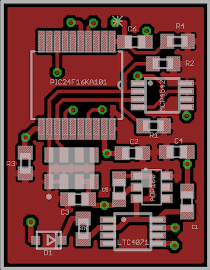
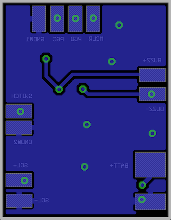
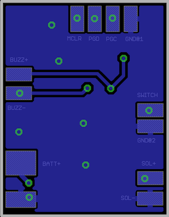
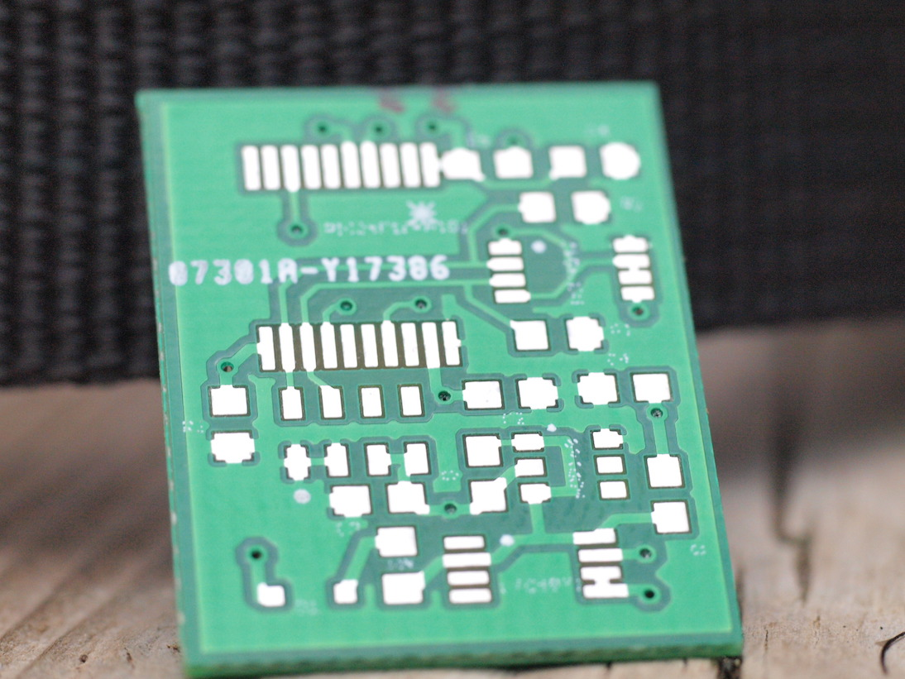
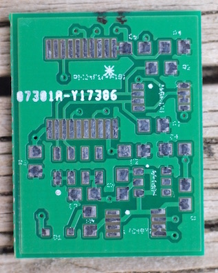
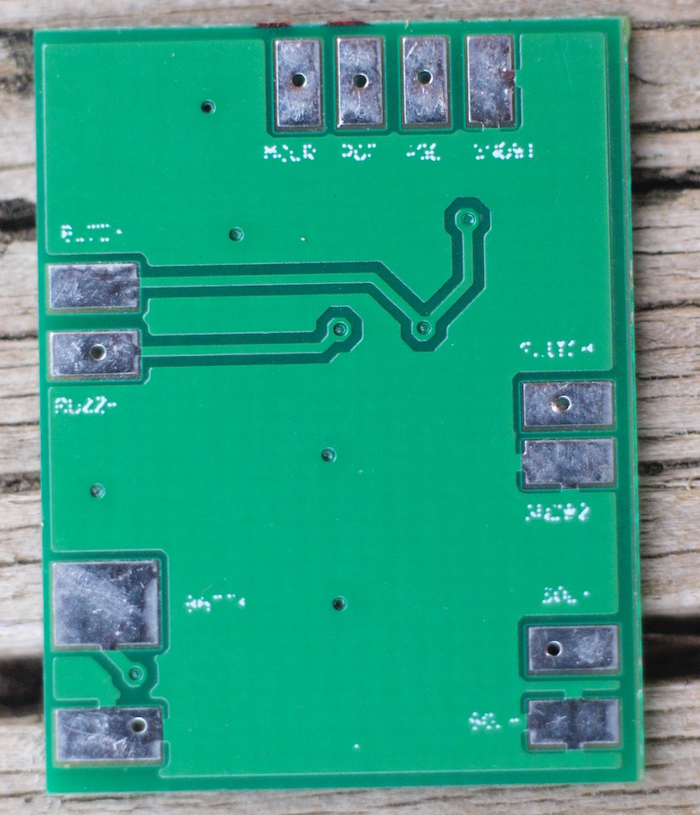
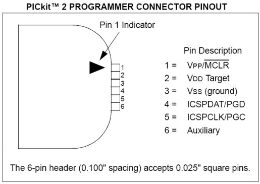

# Lightweight solar variometer for free flight

## Purpose
This project is about buiding a simple, lightweight, energey self-sufficient and helmet embbeded variometer. It is small enough to remain in the helmet's inner coat and draws its energy from the sun. A small battery can provide power during shaded times up to 10 hours.

This repo containsthe sources, pcb design files (eagle format), gerber files and a few instructions to build it, including pictures and bill of materials. The firmware must be loaded into the pic, so you will need a programmer such as a PICKIT or some arduino DIY one.

Key features :
- 1mA@3V power consumption
- 0.1 m/s detection threshold
- no need to recharge or change battery
- embedded in helmet
- 22mm x 17mm pcb size

## Electronic parts needed
The variometer transcribes vertical speed to audio signal and must contain a power manager with a solar panel and a backup battery. Here are the comonent nedded :

* **[MS5611](http://www.te.com/usa-en/product-CAT-BLPS0036.html)** : absolute pressure sensor.

* **[PIC24F16KA101](https://www.microchip.com/wwwproducts/en/PIC24F16KA101)** : this microcontroller is the brain of the vario. It communicates with the pressure sensor, does all the calculations and generates the audio signal. You mest get the 20 leads SSOP package.

* **[MCP4542](https://www.microchip.com/wwwproducts/en/MCP4542)** : Microchip digital I2C potentiometer used to adjust audio volume.

* **[ADP160](http://www.analog.com/en/products/power-management/ldo-linear-regulators/positive-linear-regulators/adp160.html)** : Analog Device ultra low quiescent current ldo regulator. It supplies stabilized power to electronics. Get the 2.8 or 3V version.

* **[LTC4071](http://www.analog.com/media/en/technical-documentation/data-sheets/4071fc.pdf)** : power manager. It havests solar energey and manages system load supplying/battery charging/power path handling. The current shunt limit is 50mA, so make sure your solar panel maximum current is under this value.

* **solar cell** : power supply. The system is designed for 6V/50mA max solar panel. I use two flexible 3V/12mA solar cells (ref [sp3-12](http://www.flexsolarcells.com/index_files/OEM_Components/Flex_Cells/pages/PowerFilm-Solar-OEM-00-Solar-Cell-Module-SP3-12.php)).

* **buzzer** : i like the kingstate's [KPEG006](http://uk.farnell.com/kingstate/kpeg006/receiver-piezo-leads/dp/1299873). It is flat and easy to fit under inner coat.

* **shottky diode** : used to protect solar panel. I use a [Nexperia 1PS76SB10](http://fr.farnell.com/nexperia/1ps76sb10/diode-schottky/dp/1081179?ost=1081179&scope=partnumberlookahead&exaMfpn=true&searchref=searchlookahead&ddkey=http%3Afr-FR%2FElement14_France%2Fw%2Fsearch).

* **3.6 lithium ion battery**. I use a [LIR2016](http://www.eemb.com/public/image/download/LIR2016.pdf)

* some capacitors and resistors (0603 package)

For detailed list of components, including packages and values, see the [part list](https://github.com/samp38/varioSmooth/blob/master/doc/partList.txt).

## PCB

The schematics and GERBER files are in the [pcb folder](pcb).  [iTead](https://www.itead.cc/open-pcb/pcb-prototyping/2layer-green-pcb-5cm-x-5cm-max.html) pcb protoyping service is a good deal to get your boards (10$ for 10 pieces).

## Programming the board
### Binary  file
The code can be found in the [MPLABX project folder](VarioSMooth.X). Microchip's MPLABX IDE is free, as is the XC16 compiler. If you don't feel like building it, just download the [binary file](https://github.com/samp38/varioSmooth/releases/download/v/VarioSMooth.hex) in the [releases page](https://github.com/samp38/varioSmooth/releases).

### Upload to the board
The PIC can be programmed via the PGC and PGD pads on the bottom of the board. Ground and a Power must also be ok (VCC from programmer or the solar panel/battery). I used a PICKT 2, very cheap programmer for PICs.

## Wiring & Using
The following elements are to be connected to the board (bottom pads) :
* Switch ('momentary on', i use a key switch like [this one](https://goo.gl/images/q1apYJ)). Pads **SWITCH** and **GND**.
* Solar panel. Pads **SOL+** and **SOL-**.
* Buzzer. Pads **BUZZ+** and **BUZZ-**.
* Battery. Pads **BATT+** and **GND**.

Once everything is set up, just get your solar panel under the sun and it should start up. Short press on button allows to start up or adjust volume, long press to shut down. A 2 minutes time out is set up in order to shut down the system if there is no move detected.